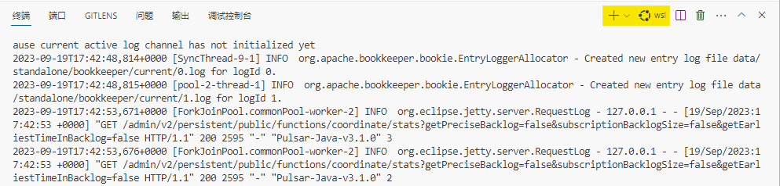

# Hello pulsar


## java client

<https://pulsar.apache.org/docs/next/client-libraries-java/>

```xml
<dependency>
  <groupId>org.apache.pulsar</groupId>
  <artifactId>pulsar-client</artifactId>
  <version>${pulsar.version}</version>
</dependency>
```

## go client

<https://pulsar.apache.org/docs/next/client-libraries-go/>

<https://github.com/apache/pulsar-client-go/tree/master/examples>

```mod
require github.com/apache/pulsar-client-go v0.9.0
```

## rust client

<https://github.com/streamnative/pulsar-rs>

<https://github.com/streamnative/pulsar-rs/tree/master/examples>

```toml
[dependencies]
futures = "0.3"
pulsar = "6.0"
tokio = { version = "1.32", features = ["full"] }
```

## how to

1 start plusar standalone

```sh
sh pulsar-docker/1.pulsar-docker-run.sh
```

if you run it on windows, please make sure the console should be wsl



2 run pulsar client

```sh
cd hello-pulsar-java
mvn exec:java
```

```sh
cd hello-pulsar-go
go run main.go
```

```sh
cd hello-pulsar-rust
RUST_LOG=info cargo run
```

## reference

<https://github.com/apache/pulsar>
